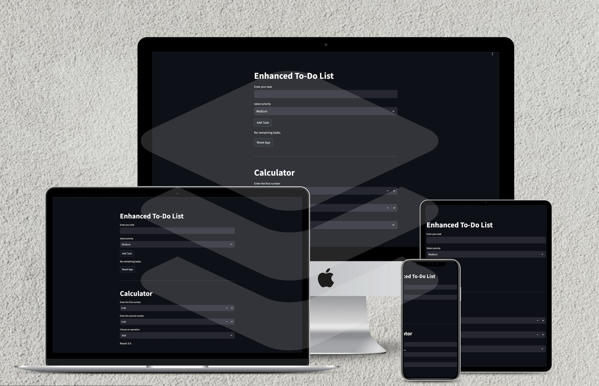
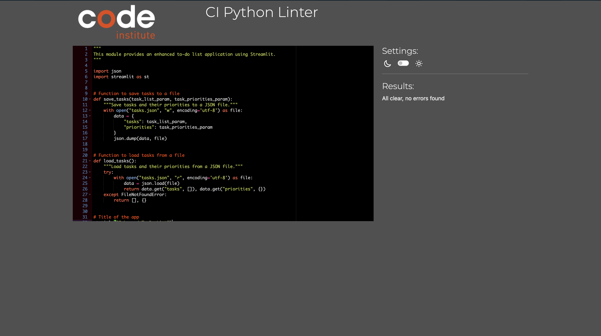

# TO-DO LIST APPLICATION

# TABLE OF CONTANTS

- Introduction
    
- User Experience (UX)

  - User Stories
  
- How to Use

- Features

  - Existing Features
  
  - Future Features
  
- Design

- Testing

- Deployment

- Credits

# Introduction

This To-Do List Application is a practical task manager created for users to keep track of tasks, organize them by priority, and manage their daily activities. Built with Streamlit, the application allows users to add, edit, delete, and reset tasks. It also includes a built-in calculator for quick math operations.

[View the live project here](https://damp-shore-53824-1295f2b0e633.herokuapp.com/)

# User Experience (UX)

User Stories:

- As a user, I want to easily add new tasks to my to-do list.

- As a user, I want to be able to assign priorities to my tasks.

- As a user, I want to edit tasks if my plans change.

- As a user, I want to delete tasks that are no longer needed.

- As a user, I want a clear and simple interface to manage my tasks.

- As a user, I want the app to save my task list, so I don’t lose it when I close the browser.

# How to Use

After launching the app, users can:

1. Add tasks by entering the task name and setting a priority.

2. Edit or delete tasks by interacting with buttons next to each task.

3. Reset the task list if they want to start over (Double click).

4. Use the calculator for quick calculations.

# Features

Existing Features

- Add Task: Users can input a task name and set its priority (Low, Medium, High).

- Edit Task: Users can update an existing task's name or priority.

- Delete Task: Users can remove a task once it's completed.

- Reset Task List: Users can clear all tasks with one button.

- Priority System: Tasks are color-coded based on their priority.

- Task Persistence: Tasks are saved using JSON for persistence between sessions.

- Calculator: A built-in calculator for basic math operations (addition, subtraction, multiplication, division).

# Future Features

- Task deadlines and reminders.

- Notifications for overdue tasks.

- Integration with calendar apps.

- Enhanced task filtering (by priority, due date).

# Design

- Interface: The interface is designed using Streamlit with an emphasis on simplicity and clarity, making task management efficient and easy.

- Color Scheme: Each task is color-coded according to its priority level (green for low, yellow for medium, red for high).

# Testing

The application was manually tested by:

- Adding, editing, and deleting tasks.

- Resetting the task list.

- Testing the calculator with different inputs.

- Testing responsiveness on different screen sizes.

## Testing Validator PEP8

No error founds on PEP8online.com

For further details, refer to the testing documentation https://pep8ci.herokuapp.com/

# Deployment

This application was deployed using Heroku.

- Log into Heroku.
    Create a new app.

- Connect the GitHub repository and deploy the app.

- Set environment variables and ensure the proper buildpacks (Python) are configured.

You can view the live application here: https://damp-shore-53824-1295f2b0e633.herokuapp.com/

# Credits

- Streamlit Documentation: https://docs.streamlit.io/ for the framework.

- [PEP8](https://pep8ci.herokuapp.com/#) - this page was used for checking my code for PEP8 requirements

- [To do list- You Tube] (https://www.youtube.com/watch?v=frWARrEczb4)this tutorial was followed and some Python code was taken and adapted to my application.

- Heroku Deployment Guide: For instructions on deploying Python applications.

- Icons: Freepik for task list icons.

- JSON Tutorial: For storing tasks persistently in a JSON file.